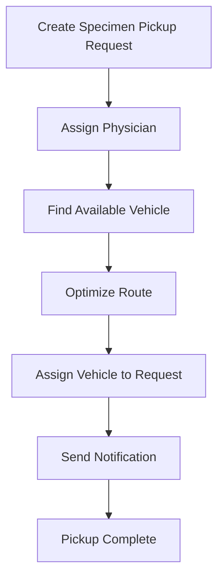
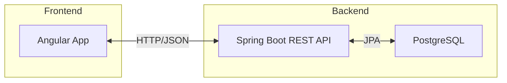

# Physician Portal Application - Architecture Diagram


---

## ER Diagram (Entities & Relationships)


---

## Flow Diagram (Specimen Pickup Assignment)


---

## ER Diagram (Mermaid)

```mermaid
erDiagram
    PHYSICIAN ||--o{ SPECIMEN_PICKUP_REQUEST : creates
    PHYSICIAN ||--o{ PHYSICIAN_WORKSTATION : assigned_to
    PHYSICIAN_WORKSTATION }o--|| WORKSTATION : contains
    VEHICLE ||--o{ SPECIMEN_PICKUP_REQUEST : assigned_to
    SPECIMEN_PICKUP_REQUEST }o--|| WORKSTATION : at_location

    PHYSICIAN {
        UUID id
        String name
        ...
    }
    VEHICLE {
        UUID id
        String registrationNumber
        ...
    }
    WORKSTATION {
        UUID id
        String address
        String landmark
        ...
    }
    SPECIMEN_PICKUP_REQUEST {
        UUID id
        LocalDateTime createdAt
        ...
    }
    PHYSICIAN_WORKSTATION {
        physician_id
        workstation_id
    }
```

---

## Flow Diagram (Mermaid)



---

## Application Architecture (Mermaid)



---

> For custom diagrams, you can use tools like draw.io, Lucidchart, or PlantUML. If you want a PlantUML diagram, let me know!
